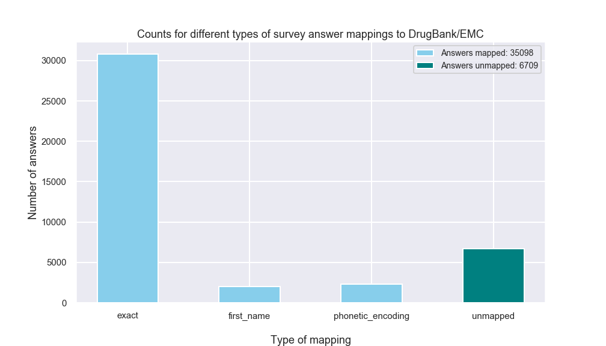
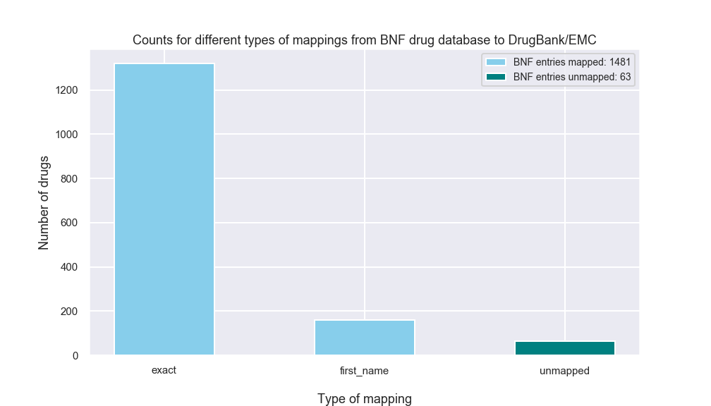

# COVIDENCE UK study 

[COVIDENCE](https://www.qmul.ac.uk/covidence/) is a COVID-19 UK national study being conducted by researchers at Queen Mary University of London,
King's College London, University of Edinburgh, Swansea University, Queen's University Belfast, and the London School of Hygiene and Tropical Medicine.
The first part of the study follows a cohort of approximately 10,000 UK residents with monthly surveys related to lifestyle, 
physical wellbeing, and mental health. If you are interested in participating, please follow the link above. For any specific inquiries
about the study please contact Chief Investigator Adrian Martineau (a.martineau@qmul.ac.uk) or Principal Investigator Hayley Holt (h.holt@qmul.ac.uk).

This is a repository containing Python scripts for cleaning, transforming, and mapping answers from the survey to patient features
that will be statistically analysed in the study. We hope to identify what types of patients are more or less likely to contract COVID-19.

**Due to privacy considerations, no patient-level data is included in this repository**. 
However, we do include multiple data sets generated from scripts that automatically pull data from public internet resources (e.g. the BNF). 
Most scripts can be run without the patient-level data.

## Objectives

1. The primary objective of this workflow is to annotate individual survey respondents with different classes of drugs based 
on the medications they listed in their survey answers. By annotating patients with drug classes rather than individual medications, 
this study can achieve sufficient statistical power to infer whether different types of medicine are associated with patients 
developing COVID-19.

2. A secondary objective involves calculating [Indices of Multiple Deprivation](https://www.gov.uk/government/statistics/english-indices-of-deprivation-2019)
using the postcodes that respondents provided to the survey. Here, we hope to ascertain whether certain socio-economic factors
are associated with patients developing COVID-19.

## Dependencies

This pipeline requires the following packages:
- beautifulsoup4==4.9.1
- pandas==1.1.0
- abydos==0.5.0
- numpy==1.19.1
- scipy==1.5.0

For the plotting done in [`Drug_mapping_plots.ipynb`](Drug_mapping_plots.ipynb):
- matplotlib==3.3.1
- seaborn==0.10.1

## 1) Medication data

### DrugBank

We use data from the [DrugBank](https://www.drugbank.ca/)
database as a list of drug names mapped to standard identifiers for active ingredients. 
DrugBank kindly makes their entire database available as an XML file to users who sign up, request a download, and specify how the data will be used. 
However, because these data are not publicly available, they have been omitted from this repository. 
Users can request a download [here](https://www.drugbank.ca/releases/latest). 
In order to reproduce this workflow, the downloaded XML file should be named `drugbank.xml` and moved to the `/data` directory.

To parse the XML file and map drug aliases to the IDs of their active ingredients, we provide the [`Parse_drugbank.py`](Parse_drugbank.py) script,
which returns a dictionary - `drug_dictionary` - containing medication names as keys mapped to the DrugBank IDs of their active ingredients.

### Electronic Medicines Compendium (EMC)

Because DrugBank is a North American organisation, the database does not include the names of certain European medications. 
To fill these gaps, we provide the [`Get_EMC_drugs.py`](Get_EMC_drugs.py) script, which imports the drug dictionary from [`Parse_drugbank.py`](Parse_drugbank.py):

``` python
# get the DrugBank drug dictionary
from Parse_drugbank import drug_dictionary
```

and scans the [EMC drug list](https://www.medicines.org.uk/emc/browse-medicines) to identify medications listed on the EMC that are not present in the drug dictionary.
The script pulls the active ingredients of these missing medications and adds an entry to the drug dictionary for each medication name, mapping it to the IDs
of its active ingredients. This generates an updated version of the drug dictionary that contains aliases from both the 
EMC and DrugBank. This updated file is saved as a pickle file under `/data/drug_dictionary.p`. This file is included in the repository.

To reproduce the workflow, simply run via the command line from the repository:

``` 
python Get_EMC_drugs.py
```

### Mapping medications from survey respondents

The survey responses listing each participant's medication(s) were collected as a CSV file (not included). 
Overall, 23,821 medications were provided across 6,624 respondents who provided at least one medication each.

The raw survey data takes the form of a csv file with patients as rows and columns for the answers they provide to questions on the survey.
Survey participants were allowed to provide 20 answers (corresponding to 20 columns) for each drug-related question. Three drug-related questions were asked, regarding:

- q1421. Which medications are you taking? 
- q1431. What dosages?
- q1432. What dosage unit for each dosage? (referring to answers to q1431 - 1 indicates milligrams, 2 indicates micrograms)

resulting in a ~10,000-column and 60+ row table, with unique identifiers for patients listed under the column 'uid'. 

We use 5-letter identifiers at the start of the column names to distinguish different entries under the same question from
entries for different questions (e.g. q1431_1 and q1432_1 correspond to different questions, while q1431_1 and q1431_2 correspond to two answers to the same question).
Survey answers that were not provided can be left empty in the CSV file (producing NumPy NA values), or filled-in with -99. 
Overall, the input CSV should look like this:

| uid | q1421_1 | ... | q142_20 | q1431_1 | ... | q143_20 | q1432_1 | ... | q143_2 |
| --- | --- | --- | --- | --- | --- | --- | --- | --- | ---|
| 001 | paracetamol | ... | -99 | 500 | ... | -99 | 1 | ... | -99 |
| 002 | lisinopril | ... | -99 | 5 | ... | -99 | 1 | ... | -99 |

We provide the [`Map_survey_answers.py`](Map_survey_answers.py) script for mapping the raw answers to the drug dictionary. 
The script defines the `AnswerMapper` class, which takes a drug dictionary and survey answer filepath as input.
The class checks for exact matches and phonetic matches between the survey answers and the drug dictionary and saves a list of answers that could not be mapped.

In our data set this was approximately 3,000 answers (12.5%).



### Mapping misspelled answers

For the remaining 3,000 answers, we provide the [`Map_by_LV_distance.py`](Map_by_LV_distance.py) script, which scans the drug dictionary for aliases 
that are a Levenshtein distance of 1 unit away from each answer, in order to identify the closest match for each. 
We use the [abydos implementation of Levenshtein distance](https://abydos.readthedocs.io/en/latest/abydos.distance.html#abydos.distance.Levenshtein) for 
the distance calculations. For answers with more than one alias
with a distance of 1, we take the alias with the active ingredients appearing at the highest frequency in the rest of the survey answers:

``` python
# get matches that are a distance of 1 away
matches = [alias for alias, distance in distances.items() if distance == 1]

# if there are multiple matches that are a distance of 1 away, take the one that appears at the highest frequency
if matches:
    best_match = max(matches, key = lambda alias: np.mean([drug_frequencies[db_id] for db_id in drug_dictionary[alias]]))
    mapped_by_lv_distance[answer] = best_match
```

For this final round of mapping, the script should be executed as follows:

```
python Map_by_LV_distance.py path/to/medication/answer/csv
```

The Levenshtein distance-mapped and the remaining unmapped answers (with distance > 1 for all drug dictionary aliases) are outputted 
as a CSV file to `/data/answer_mappings.csv`. The unmapped answers were annotated manually, with the help of four medical students at Queen Mary:

- Sultan Saeed Rajpoot
- Philipa Jane Lloyd
- Sarah El Rifai
- Ahmed Ali Kayyale

We provide the full answer mappings as the file `/data/answer_mappings_complete.csv`, 
containing both the distance-based and manual annotations for the misspelled survey answers.

### Getting BNF classes

To generate data on the [British National Formulary](https://bnf.nice.org.uk/drug/) drug classifications for different medications, we provide the [`Get_BNF_classes.py`](Get_BNF_classes.py) script. 
If this script is run from the command line:

``` 
python Get_BNF_classes.py
```

it pulls drug class data from the BNF website using BeautifulSoup, and saves drug names, primary classifications, and secondary classifications in a Pandas DataFrame. 

Overall, 96% of BNF drug listings were successfully mapped to the drug dictionary.



The BNF DataFrame is then converted into a CSV file and saved:

``` python
bnf_classes.to_csv('data/bnf_drug_classifications.csv', index_label='entry')
```

We include this file in the repository, under the path shown above.

### Annotating patients with BNF drug classes

To annotate individual patients in the survey with the BNF drug classes being investigated, we provide the [`Annotate_patients.py`](Annotate_patients.py) script.
Each patient is annotated with more than 20 drug classes to be analysed as covariates, with each covariate taking a value of 1 if the patient listed medications from that class and 0 if not.
Some examples of classes being investigated include:

- Statins
- ACE inhibitors
- Proton pump inhibitors
- Corticosteroids

The script should be run from the command line with the path to the survey answer file as a positional argument, for example:

```
python Annotate_patients.py path/to/medication/answer/csv
```

You can add the names of the medication, dosage, and unit question columns with the `-q` argument as follows:

```
python Annotate_patients.py path/to/medication/answer/csv -q med_q_column dosage_q_column units_q_column
```

The `-q` arguments default to 'q1421', 'q1431', and 'q1432', the column names in our case.

You can also add the name of the unique patient identifier column with the `-id` command:

```
python Annotate_patients.py path/to/medication/answer/csv -id uid
```

The script outputs a CSV file (not included) containing the patient-level information for each drug class.

### Incorporating dosage data

We extend the pipeline to further incorporate the drug dosage data provided for each patient. Rather than labelling each patient
with a binary value for each drug class (1 or 0), we aim to capture a dose-response relationship between each medication
class and the probability of developing COVID-19.

For each drug dosage value, we calculate a z-score relative to all dosage values for the same drug:

``` python
from scipy.stats import zscore, norm
...
# calculate z score
valid_dosages_scaled = zscore(valid_dosages)
```

And normalise the output to the [0, 1] range using a probit function:

``` python
# normalised using probit function
valid_dosages_norm = pd.Series(norm.cdf(valid_dosages_scaled), index = valid_dosages.index)
```

Again, the script should be run from the command line with a filepath to the survey answers:

``` 
python Annotate_patient_dosages.py path/to/medication/answer/csv
```

As with [`Annotate_patients.py`](Annotate_patients.py), the medication, dosage, and unit column names can be specified with the `-q` argument, 
while the patient identifier column name can be specified with the `-id` argument.

The script then outputs the patient-level drug scores in a CSV file (not included here)

## 2) Postcode data

### Mapping postcodes to Index of Multiple Deprivation (IMD)

We also provide the [`Map_IMD_data.py`](Map_IMD_data.py) script for mapping the patient postcodes provided to the survey (not included) to values of the [Index of Multiple Deprivation](https://www.gov.uk/government/statistics/english-indices-of-deprivation-2019) (IMD).
This script first imports a postcode metadata set (not included due to size constraints) - `/data/postcode_data.csv` - obtained from [this](https://www.doogal.co.uk/ukpostcodes.php) website.

It then imports the excel spreadsheet `/data/UK_postcode_IMDs.xlsx` (included), which contains postcode-IMD pairs in for postcodes in England, Wales, and Scotland: 

``` python
england_imd_data = pd.read_excel('data/UK_postcode_IMDs.xlsx', sheet_name = 'english_postcode_IMDs')
...
scotland_imd_data = pd.read_excel('data/UK_postcode_IMDs.xlsx', sheet_name = 'scottish_postcode_IMDs')
...
welsh_imd_data = pd.read_excel('data/UK_postcode_IMDs.xlsx', sheet_name = 'welsh_postcode_IMDs')
```

and maps the respondent postcodes to IMD deciles and ranks. 
For Northern Irish postcodes, we use urllib and BeautifulSoup to input the respondent postcodes into the [web API](https://deprivation.nisra.gov.uk/) provided by the Northern Irish government and save the resulting output.

The script should be run from the command line with a path to a CSV file containing the postcode answers as the first positional argument:

``` 
python Map_IMD_data.py path/to/postcode/answer/csv
```

You can specify the name of the column containing the postcodes with the `-p` argument:

``` 
python Map_IMD_data.py path/to/postcode/answer/csv -p pcode
```

The patient mappings to IMD ranks and deciles are saved as a CSV file (not included in this repository).